# 设计文档

## 概述

小鬼消消乐是一款基于 PixiJS v8.14.0 的浏览器消除类游戏，使用模块化、事件驱动的架构设计。系统分为五个核心模块：游戏引擎、渲染引擎（基于 PixiJS）、输入管理器、状态管理器和事件总线。每个模块职责单一，通过事件系统进行松耦合通信。

**技术架构说明**：
- **运行环境**: 现代浏览器（游戏逻辑完全在浏览器端运行）
- **渲染引擎**: PixiJS v8.14.0（WebGL + Canvas 降级）
- **开发工具**: Vite v5.0（开发服务器）+ Node.js 18+（仅用于开发环境）
- **编程语言**: 原生 JavaScript（ES6+ Modules）
- **资源构建**: sharp v0.33.0（SVG 转 PNG）

Node.js 仅用于开发服务器（Vite）和资源构建工具（sharp），游戏逻辑完全运行在浏览器端。

### 技术选型

#### 游戏引擎/框架选择

经过对主流HTML5游戏引擎的调研和工作量评估，本项目选择**PixiJS v8.14.0**作为渲染引擎。这个决策基于以下考虑：

**主流引擎对比**：

1. **Phaser 3** (v3.80.1 - 2024年最新稳定版)
   - 优点：功能完整、社区活跃、文档丰富
   - 缺点：体积较大（~1.2MB压缩后）、学习曲线陡峭、对简单消除游戏过于复杂
   - 适用场景：复杂的动作游戏、平台游戏

2. **PixiJS** (v8.14.0 - 2024年最新稳定版) ⭐ **最终选择**
   - 优点：高性能2D渲染、WebGL自动加速、轻量级（~400KB压缩后）、精灵系统完善
   - 缺点：主要是渲染库而非完整游戏引擎、需要自己实现游戏逻辑
   - 适用场景：需要大量精灵和粒子效果的游戏、消除类游戏

3. **Kaboom.js** (v3000.1.17 - 2024年最新版)
   - 优点：API简洁、快速原型开发、适合初学者
   - 缺点：功能相对有限、社区较小
   - 适用场景：简单的2D游戏、游戏jam

4. **原生Canvas API**
   - 优点：零依赖、完全控制、体积最小、学习成本低
   - 缺点：需要自己实现动画、精灵管理等基础功能，开发工作量大
   - 适用场景：极简单的2D游戏、对体积有严格要求的项目

**最终选择：PixiJS v8.14.0 + 自定义游戏逻辑**

理由：
- **降低30-40%开发工作量**：内置精灵系统、补间动画、事件处理
- **更好的性能**：WebGL硬件加速，自动降级到Canvas
- **适合准生产级项目**：成熟稳定，大量商业游戏使用
- **便于实现特殊图标**：精灵系统天然支持复杂视觉效果
- **保持模块化设计**：PixiJS只负责渲染，游戏逻辑仍然自主实现
- **活跃的社区**：文档完善，问题容易解决
- **体积可接受**：压缩后约400KB，对于游戏项目合理
- **最新稳定版本**：v8.14.0 包含最新的性能优化和bug修复

#### 技术栈详细说明

- **运行环境**: 
  - **游戏运行环境**: 现代浏览器（支持 ES6+、WebGL 2.0）
  - **开发环境**: Node.js v18.x+ (LTS) - 仅用于 Vite 开发服务器和资源构建
  - **游戏逻辑**: 完全运行在浏览器端，使用原生 JavaScript + PixiJS
  - **无需服务器**: 游戏是纯前端应用，可部署到静态服务器
  
- **核心技术**:
  - **PixiJS v8.14.0** - 2D 渲染引擎（WebGL + Canvas 降级）
  - **npm** - 包管理工具，管理 PixiJS 等依赖
  - **ES6+ Modules** - 模块化代码组织
  - **Vite v5.0+** - 现代化开发服务器和构建工具
  - **Web APIs** - Event Listeners, Performance API, requestAnimationFrame

- **PixiJS 核心功能使用**:
  - `PIXI.Application` - 应用程序容器和渲染循环
  - `PIXI.Sprite` - 图标精灵对象
  - `PIXI.Graphics` - 绘制几何图形（背景、边框等）
  - `PIXI.Container` - 场景图管理
  - `PIXI.Text` - 文本渲染（分数、UI）
  - `PIXI.Ticker` - 游戏循环和帧更新（基于 requestAnimationFrame）
  - `PIXI.Assets` - 资源加载系统
  - 补间动画：自定义轻量级补间系统（无需 GSAP）

- **开发工具**:
  - **开发服务器**: Vite v5.0+ （快速热更新、自动处理模块）
  - **包管理**: npm（管理 PixiJS 等依赖）
  - **代码规范**: ESLint（可选）
  - **测试框架**: Node.js 内置 test runner（Node 18+）用于逻辑测试
  - **构建工具**: Vite（生产环境打包优化）
  - **图像处理**: sharp v0.33.0（SVG 转 PNG，跨平台兼容）

- **模块加载策略**:
  - 使用 ES6 原生模块系统（`import/export`）
  - **开发环境**: Vite 自动处理模块解析和热更新
  - **PixiJS 导入**: `import * as PIXI from 'pixi.js'`（从 npm 包导入）
  - **本地模块**: 使用相对路径（如 `./core/EventBus.js`）
  - **生产环境**: Vite 自动打包、代码分割、tree-shaking

- **依赖管理**:
  ```json
  // package.json
  {
    "dependencies": {
      "pixi.js": "^8.14.0"  // PixiJS 渲染引擎（最新稳定版 2024）
    },
    "devDependencies": {
      "vite": "^5.0.0",     // 开发服务器和构建工具
      "sharp": "^0.33.0"    // 图像处理工具（SVG 转 PNG，替代过时的 svg2png）
    }
  }
  ```
  
  **注意**：不使用 `svg2png` 包，因为它已过时（最后更新2016年）且依赖 PhantomJS，在现代 Node.js 环境中有兼容性问题。sharp 是现代、高性能、跨平台的替代方案。

- **开发服务器配置**:
  使用 Vite 作为开发服务器（推荐方案）：
  
  ```javascript
  // vite.config.js
  import { defineConfig } from 'vite';
  
  export default defineConfig({
    server: {
      port: 5173,
      open: true, // 自动打开浏览器
    },
    build: {
      outDir: 'dist',
      sourcemap: true,
      rollupOptions: {
        output: {
          manualChunks: {
            'pixi': ['pixi.js'], // 将 PixiJS 单独打包
          },
        },
      },
    },
    optimizeDeps: {
      include: ['pixi.js'], // 预构建 PixiJS
    },
  });
  ```
  
  **Vite 优势**:
  - ⚡ 极速热更新（HMR）
  - 📦 自动处理 node_modules 导入
  - 🔧 零配置开箱即用
  - 🚀 生产构建优化（代码分割、压缩、Tree-shaking）
  - 🎯 原生 ES 模块支持
  - 🔥 开发环境按需编译（启动速度快）

- **浏览器兼容性**:
  - Chrome 90+
  - Firefox 88+
  - Safari 14+
  - Edge 90+

- **架构模式**: 
  - 事件驱动架构（Event-Driven Architecture）
  - 简化的ECS模式（Entity-Component-System）
  - 发布-订阅模式（Pub-Sub）
  - 状态机模式（State Machine）

## 架构

### 系统架构图


### 模块职责

1. **Event Bus（事件总线）**: 中央消息系统，实现模块间解耦通信
2. **Game Engine（游戏引擎）**: 核心游戏逻辑协调器
3. **Board Manager（游戏板管理器）**: 管理游戏板数据结构和操作
4. **Match Detector（匹配检测器）**: 检测和标记匹配的图标
5. **Animation Controller（动画控制器）**: 管理所有动画效果
6. **Render Engine（渲染引擎）**: Canvas绘制和视觉呈现
7. **Input Manager（输入管理器）**: 处理用户输入事件
8. **State Manager（状态管理器）**: 管理游戏状态机

## 组件与接口

### 1. Event Bus（事件总线）

**职责**: 提供发布-订阅模式的事件系统

**接口**:
```javascript
class EventBus {
  on(eventName, callback)      // 订阅事件
  off(eventName, callback)     // 取消订阅
  emit(eventName, data)        // 发布事件
  once(eventName, callback)    // 一次性订阅
}
```

**关键事件**:

| 事件名称                | 触发时机                     | 数据载荷                            | 订阅者                     |
| ----------------------- | ---------------------------- | ----------------------------------- | -------------------------- |
| `game:init`             | 游戏初始化完成               | `{ board, config }`                 | RenderEngine               |
| `game:start`            | 游戏开始                     | `{}`                                | StateManager, RenderEngine |
| `game:reset`            | 游戏重置                     | `{}`                                | GameEngine, RenderEngine   |
| `tile:select`           | 图标被选中                   | `{ tile, position }`                | RenderEngine, GameEngine   |
| `tile:deselect`         | 图标取消选中                 | `{ tile }`                          | RenderEngine               |
| `tile:swap:start`       | 开始交换图标                 | `{ tile1, tile2 }`                  | AnimationController        |
| `tile:swap:complete`    | 交换完成                     | `{ tile1, tile2, hasMatch }`        | GameEngine                 |
| `tile:swap:revert`      | 交换回退                     | `{ tile1, tile2 }`                  | AnimationController        |
| `match:found`           | 发现匹配                     | `{ matches: [Match], totalTiles }`  | GameEngine, RenderEngine   |
| `match:none`            | 无匹配                       | `{}`                                | GameEngine                 |
| `tile:remove:start`     | 开始消除图标                 | `{ tiles: [Tile] }`                 | AnimationController        |
| `tile:remove:complete`  | 消除完成                     | `{ tiles: [Tile] }`                 | GameEngine, BoardManager   |
| `tile:fall:start`       | 开始下落                     | `{ movements: [{tile, from, to}] }` | AnimationController        |
| `tile:fall:complete`    | 下落完成                     | `{}`                                | GameEngine                 |
| `tile:spawn:start`      | 开始生成新图标               | `{ tiles: [Tile] }`                 | AnimationController        |
| `tile:spawn:complete`   | 生成完成                     | `{}`                                | GameEngine                 |
| `score:update`          | 分数更新                     | `{ score, delta, combo }`           | RenderEngine               |
| `combo:trigger`         | 触发连锁                     | `{ comboCount, multiplier }`        | RenderEngine, GameEngine   |
| `state:change`          | 状态变化                     | `{ from, to }`                      | 所有模块                   |
| `animation:start`       | 动画开始                     | `{ type, duration }`                | StateManager               |
| `animation:complete`    | 动画完成                     | `{ type }`                          | GameEngine, StateManager   |
| `animation:queue:empty` | 动画队列清空                 | `{}`                                | GameEngine                 |
| `input:enabled`         | 启用输入                     | `{}`                                | InputManager               |
| `input:disabled`        | 禁用输入                     | `{}`                                | InputManager               |
| `board:stable`          | 游戏板稳定（无动画、无匹配） | `{}`                                | GameEngine                 |
| `board:shuffle`         | 游戏板洗牌                   | `{}`                                | BoardManager, RenderEngine |
| `game:over`             | 游戏结束                     | `{ reason, finalScore }`            | StateManager, RenderEngine |
| `moves:none`            | 无可用移动                   | `{}`                                | GameEngine                 |
| `error`                 | 错误发生                     | `{ type, message, error }`          | ErrorHandler               |

### 2. Game Engine（游戏引擎）

**职责**: 协调游戏循环和核心逻辑流程

**接口**:
```javascript
class GameEngine {
  constructor(config)
  init()                       // 初始化游戏
  start()                      // 开始游戏循环
  pause()                      // 暂停游戏
  resume()                     // 恢复游戏
  reset()                      // 重置游戏
  update(deltaTime)            // 更新游戏状态
  handleSwap(pos1, pos2)       // 处理交换请求
  processMatches()             // 处理匹配消除
  checkGameOver()              // 检查游戏结束
  calculateScore(matches, combo) // 计算分数
}
```

**连锁分数计算公式**:
```javascript
calculateScore(matches, comboCount) {
  const baseScore = this.config.scoring.baseScore; // 10分
  const comboMultiplier = this.config.scoring.comboMultiplier; // 1.5
  
  let totalScore = 0;
  
  // 基础分数：每个消除的图标10分
  const totalTiles = matches.reduce((sum, match) => sum + match.tiles.length, 0);
  const basePoints = totalTiles * baseScore;
  
  // 连锁倍数：第1次连锁1.0x，第2次1.5x，第3次2.25x，以此类推
  // 公式：multiplier = comboMultiplier ^ (comboCount - 1)
  const multiplier = Math.pow(comboMultiplier, comboCount - 1);
  
  // 最终分数 = 基础分数 × 连锁倍数
  totalScore = Math.floor(basePoints * multiplier);
  
  // 额外奖励：4个或5个以上的匹配额外加分
  for (const match of matches) {
    if (match.tiles.length === 4) {
      totalScore += 20; // 4连额外20分
    } else if (match.tiles.length >= 5) {
      totalScore += 50; // 5连及以上额外50分
    }
  }
  
  return {
    score: totalScore,
    basePoints: basePoints,
    multiplier: multiplier,
    comboCount: comboCount,
    tilesCleared: totalTiles
  };
}

// 使用示例：
// 第1次消除：3个图标 = 30分 × 1.0 = 30分
// 第2次连锁：4个图标 = 40分 × 1.5 + 20 = 80分
// 第3次连锁：5个图标 = 50分 × 2.25 + 50 = 162分
// 总分：30 + 80 + 162 = 272分
```

**状态流程**:

```mermaid
stateDiagram-v2
    [*] --> Idle: 初始化
    Idle --> WaitingInput: 准备就绪
    WaitingInput --> Swapping: 玩家交换
    Swapping --> Matching: 交换完成
    Matching --> Removing: 发现匹配
    Removing --> Falling: 消除完成
    Falling --> Filling: 下落完成
    Filling --> Matching: 填充完成
    Matching --> WaitingInput: 无匹配
    WaitingInput --> GameOver: 无可用移动
    GameOver --> [*]: 结束
```


### 3. Board Manager（游戏板管理器）

**职责**: 管理游戏板的数据结构和基本操作

**数据结构**:
```javascript
class Tile {
  constructor(type, x, y) {
    this.type = type;          // 图标类型 (0-4)
    this.x = x;                // 网格X坐标
    this.y = y;                // 网格Y坐标
    this.id = generateId();    // 唯一标识
    this.state = 'normal';     // normal | selected | matched | falling
  }
}

class Board {
  constructor(rows, cols, tileTypes) {
    this.rows = rows;          // 行数
    this.cols = cols;          // 列数
    this.tileTypes = tileTypes;// 图标类型数量
    this.grid = [];            // 二维数组存储Tile
  }
}
```

**接口**:
```javascript
class BoardManager {
  createBoard()                // 创建游戏板
  getTile(x, y)                // 获取指定位置图标
  setTile(x, y, tile)          // 设置指定位置图标
  swapTiles(pos1, pos2)        // 交换两个图标
  removeTiles(positions)       // 移除指定图标
  isAdjacent(pos1, pos2)       // 检查是否相邻
  isValidPosition(x, y)        // 检查位置是否有效
  getEmptyPositions()          // 获取空位置列表
  fillBoard()                  // 填充游戏板
  shuffleBoard()               // 洗牌
  ensureNoInitialMatches()     // 确保初始化时无匹配
  applyGravity()               // 应用重力使图标下落
  clone()                      // 克隆游戏板（用于检测）
}
```

**初始化无匹配算法**:
```javascript
ensureNoInitialMatches() {
  const maxAttempts = 100;
  let attempts = 0;
  
  while (attempts < maxAttempts) {
    const matches = this.matchDetector.findMatches(this.board);
    
    if (matches.length === 0) {
      return true; // 成功：无匹配
    }
    
    // 策略：只替换匹配的图标，而不是重新生成整个棋盘
    for (const match of matches) {
      for (const tile of match.tiles) {
        let newType;
        let safeType = false;
        
        // 尝试找到一个不会产生新匹配的类型
        for (let i = 0; i < this.tileTypes; i++) {
          newType = i;
          tile.type = newType;
          
          // 检查这个位置是否还会产生匹配
          if (!this.wouldCreateMatch(tile.x, tile.y)) {
            safeType = true;
            break;
          }
        }
        
        // 如果所有类型都会产生匹配，随机选择一个
        if (!safeType) {
          tile.type = Math.floor(Math.random() * this.tileTypes);
        }
      }
    }
    
    attempts++;
  }
  
  // 如果100次尝试后仍有匹配，强制重新生成整个棋盘
  console.warn('Failed to eliminate initial matches, regenerating board');
  this.createBoard();
  return this.ensureNoInitialMatches();
}

// 辅助方法：检查指定位置是否会产生匹配
wouldCreateMatch(x, y) {
  const tile = this.getTile(x, y);
  if (!tile) return false;
  
  // 检查横向
  let horizontalCount = 1;
  // 向左检查
  for (let i = x - 1; i >= 0 && this.getTile(i, y)?.type === tile.type; i--) {
    horizontalCount++;
  }
  // 向右检查
  for (let i = x + 1; i < this.cols && this.getTile(i, y)?.type === tile.type; i++) {
    horizontalCount++;
  }
  if (horizontalCount >= 3) return true;
  
  // 检查纵向
  let verticalCount = 1;
  // 向上检查
  for (let i = y - 1; i >= 0 && this.getTile(x, i)?.type === tile.type; i--) {
    verticalCount++;
  }
  // 向下检查
  for (let i = y + 1; i < this.rows && this.getTile(x, i)?.type === tile.type; i++) {
    verticalCount++;
  }
  if (verticalCount >= 3) return true;
  
  return false;
}
```

### 4. Match Detector（匹配检测器）

**职责**: 检测游戏板上的匹配模式

**算法**: 
- 横向扫描：遍历每行，检测连续相同类型
- 纵向扫描：遍历每列，检测连续相同类型
- 时间复杂度：O(rows × cols)

**接口**:
```javascript
class MatchDetector {
  findMatches(board)           // 查找所有匹配
  findHorizontalMatches(board) // 查找横向匹配
  findVerticalMatches(board)   // 查找纵向匹配
  hasValidMoves(board)         // 检查是否有有效移动
  findPossibleMoves(board)     // 查找所有可能的移动
}
```

**优化的无可用移动检测算法**:
```javascript
hasValidMoves(board) {
  // 优化策略1：提前终止，找到一个有效移动即返回
  // 优化策略2：使用缓存避免重复计算
  const { rows, cols } = board;
  
  // 检查缓存
  const boardHash = this.getBoardHash(board);
  if (this.validMovesCache && this.boardStateHash === boardHash) {
    return this.validMovesCache;
  }
  
  // 遍历所有可能的交换
  for (let y = 0; y < rows; y++) {
    for (let x = 0; x < cols; x++) {
      const tile = board.getTile(x, y);
      if (!tile) continue;
      
      // 只检查右侧和下方的交换（避免重复检查）
      const adjacentPositions = [
        { x: x + 1, y: y },     // 右
        { x: x, y: y + 1 }      // 下
      ];
      
      for (const adj of adjacentPositions) {
        if (!board.isValidPosition(adj.x, adj.y)) continue;
        
        const adjTile = board.getTile(adj.x, adj.y);
        if (!adjTile) continue;
        
        // 模拟交换
        board.swapTiles({ x, y }, adj);
        
        // 快速检查：只检查交换的两个位置周围是否产生匹配
        const hasMatch = this.checkMatchAtPosition(board, x, y) ||
                        this.checkMatchAtPosition(board, adj.x, adj.y);
        
        // 交换回来
        board.swapTiles({ x, y }, adj);
        
        if (hasMatch) {
          // 缓存结果
          this.validMovesCache = true;
          this.boardStateHash = boardHash;
          return true; // 找到有效移动，立即返回
        }
      }
    }
  }
  
  // 缓存结果
  this.validMovesCache = false;
  this.boardStateHash = boardHash;
  return false; // 无有效移动
}

// 生成游戏板哈希值（用于缓存）
getBoardHash(board) {
  let hash = '';
  for (let y = 0; y < board.rows; y++) {
    for (let x = 0; x < board.cols; x++) {
      const tile = board.getTile(x, y);
      hash += tile ? tile.type : '-';
    }
  }
  return hash;
}

// 清除缓存（在游戏板变化时调用）
clearCache() {
  this.validMovesCache = null;
  this.boardStateHash = null;
}

// 快速检查指定位置是否有匹配（只检查该位置，不扫描整个棋盘）
checkMatchAtPosition(board, x, y) {
  const tile = board.getTile(x, y);
  if (!tile) return false;
  
  // 检查横向匹配
  let horizontalCount = 1;
  for (let i = x - 1; i >= 0 && board.getTile(i, y)?.type === tile.type; i--) {
    horizontalCount++;
  }
  for (let i = x + 1; i < board.cols && board.getTile(i, y)?.type === tile.type; i++) {
    horizontalCount++;
  }
  if (horizontalCount >= 3) return true;
  
  // 检查纵向匹配
  let verticalCount = 1;
  for (let i = y - 1; i >= 0 && board.getTile(x, i)?.type === tile.type; i--) {
    verticalCount++;
  }
  for (let i = y + 1; i < board.rows && board.getTile(x, i)?.type === tile.type; i++) {
    verticalCount++;
  }
  if (verticalCount >= 3) return true;
  
  return false;
}
```

**匹配数据结构**:
```javascript
class Match {
  constructor(tiles, direction) {
    this.tiles = tiles;        // 匹配的图标数组
    this.direction = direction;// 'horizontal' | 'vertical'
    this.length = tiles.length;// 匹配长度
  }
}
```

### 5. Animation Controller（动画控制器 - 基于PixiJS + 补间库）

**职责**: 管理所有动画效果和时间线

**动画实现策略**:
- 使用轻量级补间库（如`gsap`或自定义补间）
- 直接操作PixiJS精灵的属性（position、scale、alpha等）
- 使用Promise链管理动画序列

**动画类型**:
- **交换动画**: 两个精灵位置互换（200ms）
- **消除动画**: 精灵缩放到0 + 淡出（300ms）
- **下落动画**: 精灵Y坐标平滑移动（400ms，缓动函数）
- **生成动画**: 精灵从顶部弹出（200ms，弹跳效果）
- **选中动画**: 边框缩放脉冲效果

**接口**:
```javascript
class AnimationController {
  constructor(eventBus)
  
  // 动画创建方法
  animateSwap(sprite1, sprite2, duration)     // 返回Promise
  animateRemove(sprites, duration)            // 返回Promise
  animateFall(sprite, targetY, duration)      // 返回Promise
  animateSpawn(sprite, duration)              // 返回Promise
  animateSelection(sprite)                    // 循环动画
  stopSelection(sprite)                       // 停止选中动画
  
  // 动画管理
  isAnimating()                // 是否有动画正在播放
  stopAll()                    // 停止所有动画
  
  // 内部方法
  _createTween(target, props, duration, easing) // 创建补间动画
  _onAnimationStart()          // 动画开始回调
  _onAnimationComplete()       // 动画完成回调
}

// 使用示例（基于Promise）
async function handleSwap(tile1, tile2) {
  await animationController.animateSwap(sprite1, sprite2, 200);
  
  if (hasMatch) {
    const matchedSprites = getMatchedSprites();
    await animationController.animateRemove(matchedSprites, 300);
    
    const fallAnimations = sprites.map(s => 
      animationController.animateFall(s, targetY, 400)
    );
    await Promise.all(fallAnimations);
    
    const spawnAnimations = newSprites.map(s =>
      animationController.animateSpawn(s, 200)
    );
    await Promise.all(spawnAnimations);
  }
}
```

**动画时间线管理策略**:

消消乐游戏的动画流程通常是：
1. **交换动画**（串行）：两个图标交换位置
2. **消除动画**（并行）：所有匹配的图标同时消除
3. **下落动画**（并行）：所有图标同时下落到目标位置
4. **生成动画**（并行）：新图标同时出现
5. **循环检测**：如果有新匹配，回到步骤2

实现策略：
```javascript
class AnimationTimeline {
  constructor() {
    this.phases = [];          // 动画阶段队列
    this.currentPhase = null;  // 当前阶段
    this.isPlaying = false;
  }
  
  // 添加一个动画阶段（阶段内的动画并行执行）
  addPhase(animations, onComplete) {
    this.phases.push({
      animations: animations,  // 该阶段的所有动画
      onComplete: onComplete,  // 阶段完成回调
      completed: false
    });
  }
  
  // 开始播放时间线
  play() {
    this.isPlaying = true;
    this.currentPhase = 0;
    this.playCurrentPhase();
  }
  
  playCurrentPhase() {
    if (this.currentPhase >= this.phases.length) {
      this.isPlaying = false;
      this.emit('timeline:complete');
      return;
    }
    
    const phase = this.phases[this.currentPhase];
    
    // 启动该阶段的所有动画（并行）
    let completedCount = 0;
    const totalAnimations = phase.animations.length;
    
    phase.animations.forEach(animation => {
      animation.onComplete = () => {
        completedCount++;
        if (completedCount === totalAnimations) {
          // 该阶段所有动画完成
          phase.onComplete?.();
          this.currentPhase++;
          this.playCurrentPhase();
        }
      };
      this.animationController.addAnimation(animation);
    });
  }
}

// 使用示例：
// 1. 交换阶段
timeline.addPhase([swapAnimation], () => {
  eventBus.emit('tile:swap:complete');
});

// 2. 消除阶段
timeline.addPhase(removeAnimations, () => {
  eventBus.emit('tile:remove:complete');
});

// 3. 下落阶段
timeline.addPhase(fallAnimations, () => {
  eventBus.emit('tile:fall:complete');
});

// 4. 生成阶段
timeline.addPhase(spawnAnimations, () => {
  eventBus.emit('tile:spawn:complete');
  // 检测新匹配，如果有则继续添加阶段
});

timeline.play();
```

**补间动画实现（轻量级，无需GSAP）**:
```javascript
// 简单的补间动画实现
class Tween {
  constructor(target, props, duration, easing = 'easeOutQuad') {
    this.target = target;
    this.startProps = {};
    this.endProps = props;
    this.duration = duration;
    this.easing = Easing[easing];
    this.elapsed = 0;
    this.isComplete = false;
    
    // 记录起始值
    for (let key in props) {
      this.startProps[key] = target[key];
    }
  }
  
  update(deltaTime) {
    this.elapsed += deltaTime;
    const progress = Math.min(this.elapsed / this.duration, 1);
    const easedProgress = this.easing(progress);
    
    // 更新属性
    for (let key in this.endProps) {
      const start = this.startProps[key];
      const end = this.endProps[key];
      this.target[key] = start + (end - start) * easedProgress;
    }
    
    if (progress >= 1) {
      this.isComplete = true;
    }
    
    return this.isComplete;
  }
}

// 缓动函数
const Easing = {
  linear: t => t,
  easeInQuad: t => t * t,
  easeOutQuad: t => t * (2 - t),
  easeInOutQuad: t => t < 0.5 ? 2 * t * t : -1 + (4 - 2 * t) * t,
  easeOutBounce: t => {
    if (t < 1 / 2.75) return 7.5625 * t * t;
    if (t < 2 / 2.75) return 7.5625 * (t -= 1.5 / 2.75) * t + 0.75;
    if (t < 2.5 / 2.75) return 7.5625 * (t -= 2.25 / 2.75) * t + 0.9375;
    return 7.5625 * (t -= 2.625 / 2.75) * t + 0.984375;
  }
};
```

### 6. Render Engine（渲染引擎 - 基于PixiJS）

**职责**: 使用PixiJS管理场景图和渲染

**PixiJS场景结构**:
```
PIXI.Application
  └─> stage (root container)
       ├─> backgroundLayer (PIXI.Container)
       │    └─> backgroundGraphics (PIXI.Graphics)
       ├─> boardLayer (PIXI.Container)
       │    └─> tileSprites[] (PIXI.Sprite)
       ├─> effectLayer (PIXI.Container)
       │    ├─> selectionGraphics (PIXI.Graphics)
       │    └─> particleEffects
       └─> uiLayer (PIXI.Container)
            ├─> scoreText (PIXI.Text)
            ├─> timerText (PIXI.Text)
            └─> buttons (PIXI.Graphics + PIXI.Text)
```

**接口**:
```javascript
class RenderEngine {
  constructor(containerElement, config, eventBus)
  init()                       // 初始化PixiJS应用
  createTileSprite(tile)       // 创建图标精灵
  updateTileSprite(sprite, tile) // 更新图标精灵
  removeTileSprite(sprite)     // 移除图标精灵
  createBackground()           // 创建背景图形
  createUI()                   // 创建UI元素
  updateScore(score)           // 更新分数显示
  updateTimer(time)            // 更新计时器显示
  highlightTile(tile)          // 高亮选中图标
  unhighlightTile(tile)        // 取消高亮
  resize()                     // 调整画布大小
  destroy()                    // 清理资源
}
```

**脏标记（Dirty Flag）优化机制**:
```javascript
class RenderEngine {
  constructor(canvas, config) {
    this.canvas = canvas;
    this.ctx = canvas.getContext('2d');
    this.config = config;
    this.dirty = true;           // 脏标记
    this.isAnimating = false;    // 是否有动画播放
  }
  
  markDirty() {
    this.dirty = true;
  }
  
  isDirty() {
    return this.dirty || this.isAnimating;
  }
  
  render(gameState) {
    // 只在需要时重绘
    if (!this.isDirty()) {
      return;
    }
    
    this.clear();
    this.renderBackground();
    this.renderBoard(gameState.board);
    this.renderUI(gameState.score, gameState.state);
    
    // 如果没有动画，清除脏标记
    if (!this.isAnimating) {
      this.dirty = false;
    }
  }
  
  // 在事件总线中订阅相关事件
  setupEventListeners(eventBus) {
    // 需要重绘的事件
    eventBus.on('tile:select', () => this.markDirty());
    eventBus.on('tile:deselect', () => this.markDirty());
    eventBus.on('score:update', () => this.markDirty());
    eventBus.on('state:change', () => this.markDirty());
    
    // 动画相关事件
    eventBus.on('animation:start', () => {
      this.isAnimating = true;
      this.markDirty();
    });
    
    eventBus.on('animation:queue:empty', () => {
      this.isAnimating = false;
    });
  }
}
```

**图标资源策略（使用美术资源）**:
- 使用SVG格式设计所有图标（普通图标 + 特殊图标）
- 通过svg2png工具将SVG转换为PNG（支持多种尺寸）
- 使用PixiJS的Assets系统加载PNG纹理
- 创建Sprite实例复用纹理（性能优化）

**资源工作流**:
```bash
# 1. 设计SVG图标（使用Figma、Illustrator等）
assets/svg/
  ├── ghosts/
  │   ├── ghost-red.svg
  │   ├── ghost-blue.svg
  │   ├── ghost-yellow.svg
  │   ├── ghost-green.svg
  │   └── ghost-purple.svg
  └── special/
      ├── bomb.svg
      ├── color-bomb.svg
      ├── row-clear.svg
      └── col-clear.svg

# 2. 转换为PNG（使用 sharp 库）
npm run build:assets
# 这会执行 scripts/convert-svg.js 脚本
# 使用 sharp 库将所有 SVG 转换为 PNG (128x128)
# sharp 优势：
#   - 高性能（基于 libvips）
#   - 跨平台兼容（Windows/Mac/Linux）
#   - 支持透明度和高质量输出
#   - 活跃维护，社区支持好

# 3. 生成的PNG资源
assets/images/
  ├── ghosts/
  │   ├── ghost-red.png      (128x128, 透明背景)
  │   ├── ghost-blue.png
  │   ├── ghost-yellow.png
  │   ├── ghost-green.png
  │   └── ghost-purple.png
  └── special/
      ├── bomb.png           (128x128, 透明背景)
      ├── color-bomb.png
      ├── row-clear.png
      └── col-clear.png
```

**图标纹理加载和精灵创建**:
```javascript
// TileTextureFactory.js
import * as PIXI from 'pixi.js';

class TileTextureFactory {
  constructor(config) {
    this.config = config;
    this.textures = new Map();
    this.isLoaded = false;
    this.loadProgress = 0;
  }
  
  async init(onProgress) {
    // 定义资源清单（使用 Vite 的相对路径）
    const assets = [
      // 普通图标
      { alias: 'ghost-red', src: '/assets/images/ghosts/ghost-red.png' },
      { alias: 'ghost-blue', src: '/assets/images/ghosts/ghost-blue.png' },
      { alias: 'ghost-yellow', src: '/assets/images/ghosts/ghost-yellow.png' },
      { alias: 'ghost-green', src: '/assets/images/ghosts/ghost-green.png' },
      { alias: 'ghost-purple', src: '/assets/images/ghosts/ghost-purple.png' },
      
      // 特殊图标
      { alias: 'bomb', src: '/assets/images/special/bomb.png' },
      { alias: 'color-bomb', src: '/assets/images/special/color-bomb.png' },
      { alias: 'row-clear', src: '/assets/images/special/row-clear.png' },
      { alias: 'col-clear', src: '/assets/images/special/col-clear.png' },
    ];
    
    try {
      // 批量加载资源（PixiJS Assets API）
      // 添加加载进度回调
      const promises = assets.map((asset, index) => 
        PIXI.Assets.load(asset.src).then(texture => {
          this.loadProgress = ((index + 1) / assets.length) * 100;
          if (onProgress) {
            onProgress(this.loadProgress);
          }
          return { alias: asset.alias, texture };
        })
      );
      
      const results = await Promise.all(promises);
      
      // 缓存纹理到 Map（方便快速访问）
      this.textures.set('type0', PIXI.Assets.get('/assets/images/ghosts/ghost-red.png'));
      this.textures.set('type1', PIXI.Assets.get('/assets/images/ghosts/ghost-blue.png'));
      this.textures.set('type2', PIXI.Assets.get('/assets/images/ghosts/ghost-yellow.png'));
      this.textures.set('type3', PIXI.Assets.get('/assets/images/ghosts/ghost-green.png'));
      this.textures.set('type4', PIXI.Assets.get('/assets/images/ghosts/ghost-purple.png'));
      
      this.textures.set('bomb', PIXI.Assets.get('/assets/images/special/bomb.png'));
      this.textures.set('color-bomb', PIXI.Assets.get('/assets/images/special/color-bomb.png'));
      this.textures.set('row-clear', PIXI.Assets.get('/assets/images/special/row-clear.png'));
      this.textures.set('col-clear', PIXI.Assets.get('/assets/images/special/col-clear.png'));
      
      this.isLoaded = true;
      console.log('✅ All textures loaded successfully');
    } catch (error) {
      console.error('❌ Failed to load textures:', error);
      
      // 错误处理：尝试重新加载失败的资源
      await this.retryFailedAssets(assets);
    }
  }
  
  async retryFailedAssets(assets, maxRetries = 3) {
    console.log('🔄 Retrying failed assets...');
    
    for (let attempt = 1; attempt <= maxRetries; attempt++) {
      try {
        // 检查哪些资源加载失败
        const failedAssets = assets.filter(asset => 
          !PIXI.Assets.cache.has(asset.src)
        );
        
        if (failedAssets.length === 0) {
          console.log('✅ All assets loaded after retry');
          return;
        }
        
        console.log(`Retry attempt ${attempt}/${maxRetries} for ${failedAssets.length} assets`);
        
        // 重新加载失败的资源
        await Promise.all(
          failedAssets.map(asset => PIXI.Assets.load(asset.src))
        );
        
      } catch (error) {
        if (attempt === maxRetries) {
          console.error('❌ Failed to load assets after retries:', error);
          throw new Error('Critical: Asset loading failed after retries');
        }
        
        // 等待后重试
        await new Promise(resolve => setTimeout(resolve, 1000 * attempt));
      }
    }
  }
  
  getTexture(key) {
    if (!this.isLoaded) {
      throw new Error('Textures not loaded yet. Call init() first.');
    }
    const texture = this.textures.get(key);
    if (!texture) {
      console.warn(`Texture not found: ${key}`);
    }
    return texture;
  }
  
  hasTexture(key) {
    return this.textures.has(key);
  }
}

// 创建图标精灵
function createTileSprite(tile, textureFactory, config) {
  const textureKey = tile.isSpecial ? tile.specialType : `type${tile.type}`;
  const texture = textureFactory.getTexture(textureKey);
  
  if (!texture) {
    throw new Error(`Texture not found for key: ${textureKey}`);
  }
  
  const sprite = new PIXI.Sprite(texture);
  
  // 设置锚点为中心（便于旋转和缩放）
  sprite.anchor.set(0.5);
  
  // 设置精灵尺寸
  sprite.width = config.rendering.tileSize;
  sprite.height = config.rendering.tileSize;
  
  // 计算屏幕位置
  const { x: screenX, y: screenY } = gridToScreen(
    tile.x, 
    tile.y, 
    config.rendering.tileSize,
    config.rendering.boardOffsetX,
    config.rendering.boardOffsetY
  );
  
  sprite.position.set(screenX, screenY);
  
  // 设置交互属性
  sprite.eventMode = 'static'; // PixiJS v8 新 API
  sprite.cursor = 'pointer';
  
  // 存储图块数据引用（便于事件处理）
  sprite.tileData = tile;
  
  return sprite;
}
```

**坐标转换**:
```javascript
// 网格坐标 -> 屏幕坐标（PixiJS坐标系）
function gridToScreen(gridX, gridY, tileSize, offsetX, offsetY) {
  return {
    x: gridX * tileSize + offsetX + tileSize / 2,  // 精灵锚点在中心
    y: gridY * tileSize + offsetY + tileSize / 2
  };
}

// 屏幕坐标 -> 网格坐标
function screenToGrid(screenX, screenY, tileSize, offsetX, offsetY) {
  return {
    x: Math.floor((screenX - offsetX) / tileSize),
    y: Math.floor((screenY - offsetY) / tileSize)
  };
}
```

### 7. Input Manager（输入管理器）

**职责**: 处理用户输入并转换为游戏事件

**接口**:
```javascript
class InputManager {
  constructor(canvas)
  init()                       // 初始化输入监听
  handleClick(event)           // 处理点击事件
  handleMouseMove(event)       // 处理鼠标移动
  handleTouchStart(event)      // 处理触摸开始
  handleTouchEnd(event)        // 处理触摸结束
  destroy()                    // 清理监听器
}
```

**输入状态**:
```javascript
class InputState {
  constructor() {
    this.selectedTile = null;  // 当前选中的图标
    this.hoverTile = null;     // 鼠标悬停的图标
    this.isDragging = false;   // 是否正在拖拽
  }
}
```

### 8. State Manager（状态管理器）

**职责**: 管理游戏状态机和状态转换

**游戏状态**:
```javascript
const GameState = {
  MENU: 'menu',                // 主菜单
  PLAYING: 'playing',          // 游戏中
  PAUSED: 'paused',            // 暂停
  GAME_OVER: 'game_over',      // 游戏结束
  ANIMATING: 'animating'       // 动画播放中
};
```

**接口**:
```javascript
class StateManager {
  constructor(initialState)
  getCurrentState()            // 获取当前状态
  setState(newState)           // 设置新状态
  canTransition(from, to)      // 检查是否可以转换
  onStateEnter(state)          // 状态进入回调
  onStateExit(state)           // 状态退出回调
}
```

**状态转换规则**:

```mermaid
stateDiagram-v2
    [*] --> MENU
    MENU --> PLAYING: 开始游戏
    PLAYING --> ANIMATING: 触发动画
    ANIMATING --> PLAYING: 动画完成
    PLAYING --> PAUSED: 暂停
    PAUSED --> PLAYING: 继续
    PLAYING --> GAME_OVER: 无可用移动
    GAME_OVER --> MENU: 重新开始
    PAUSED --> MENU: 退出
```


## 数据模型

### 配置对象

```javascript
const GameConfig = {
  board: {
    rows: 8,
    cols: 8,
    tileTypes: 5
  },
  rendering: {
    tileSize: 64,
    padding: 8,
    canvasWidth: 600,
    canvasHeight: 700
  },
  animation: {
    swapDuration: 200,
    removeDuration: 300,
    fallDuration: 400,
    spawnDuration: 200
  },
  scoring: {
    baseScore: 10,
    comboMultiplier: 1.5
  },
  colors: {
    type0: '#FF6B6B',  // 红色小鬼
    type1: '#4ECDC4',  // 青色小鬼
    type2: '#FFE66D',  // 黄色小鬼
    type3: '#A8E6CF',  // 绿色小鬼
    type4: '#C7CEEA'   // 紫色小鬼
  }
};
```

### 游戏状态对象

```javascript
class GameData {
  constructor() {
    this.score = 0;
    this.moves = 0;
    this.combo = 0;
    this.board = null;
    this.selectedTile = null;
    this.isProcessing = false;
  }
}
```

## 错误处理

### 错误类型

1. **初始化错误**: Canvas未找到、配置无效
2. **游戏逻辑错误**: 无效的交换、越界访问
3. **渲染错误**: Canvas上下文丢失
4. **动画错误**: 动画队列溢出

### 错误处理策略

```javascript
class GameError extends Error {
  constructor(type, message) {
    super(message);
    this.type = type;
    this.timestamp = Date.now();
  }
}

// 错误处理器
class ErrorHandler {
  static handle(error) {
    console.error(`[${error.type}] ${error.message}`);
    
    switch(error.type) {
      case 'INIT_ERROR':
        // 显示错误提示，阻止游戏启动
        break;
      case 'LOGIC_ERROR':
        // 记录错误，尝试恢复游戏状态
        break;
      case 'RENDER_ERROR':
        // 尝试重新初始化渲染器
        break;
    }
  }
}
```

## 测试策略

### 单元测试

**测试策略**:
- **目标覆盖率**: 
  - 核心逻辑模块（BoardManager, MatchDetector）：80%+
  - 游戏引擎（GameEngine）：60%+
  - 渲染和动画模块：手动测试为主
  - 总体覆盖率：40-50%
- **测试工具**: Node.js 内置 test runner (v18+)
- **测试重点**: 游戏逻辑模块，渲染和动画主要靠手动测试
- **测试类型**:
  - 单元测试：核心算法和数据结构
  - 集成测试：模块间交互和事件流
  - 性能测试：匹配检测、动画性能
  - 手动测试：视觉效果、用户体验

**测试模块**:
- `BoardManager`: 测试游戏板操作（创建、交换、移除）
- `MatchDetector`: 测试匹配检测算法的准确性
- `EventBus`: 测试事件订阅和发布机制
- `SpecialTileManager`: 测试特殊图标生成和激活逻辑

**关键测试用例**:

1. **BoardManager测试**:
   - 创建8x8游戏板，验证所有位置都有图标
   - 初始化后无任何匹配
   - 交换相邻图标成功
   - 交换不相邻图标失败
   - 移除图标后位置为空
   - 应用重力后图标正确下落
   - 边界情况：访问越界位置返回null

2. **MatchDetector测试**:
   - 检测横向3连匹配
   - 检测纵向3连匹配
   - 检测4连和5连匹配
   - 检测L型和T型匹配（多个匹配重叠）
   - 无匹配时返回空数组
   - hasValidMoves在有可用移动时返回true
   - hasValidMoves在无可用移动时返回false
   - 边界情况：棋盘边缘的匹配检测

3. **EventBus测试**:
   - 订阅事件后能接收到发布的消息
   - 取消订阅后不再接收消息
   - once订阅只触发一次
   - 同一事件多个订阅者都能接收
   - 发布不存在的事件不报错

4. **SpecialTileManager测试**:
   - 4连匹配生成炸弹
   - 5连匹配生成彩色炸弹
   - L型/T型匹配生成横向/纵向消除
   - 炸弹激活消除3x3范围
   - 彩色炸弹激活消除所有相同类型
   - 特殊图标组合效果正确

5. **GameEngine集成测试**:
   - 完整的交换-匹配-消除-下落流程
   - 连锁反应正确触发
   - 分数计算正确（包括连锁倍数）
   - 无可用移动时触发游戏结束或洗牌

**测试示例**:
```javascript
// tests/MatchDetector.test.js
import { test } from 'node:test';
import assert from 'node:assert';
import { MatchDetector } from '../src/game/MatchDetector.js';
import { BoardManager } from '../src/game/BoardManager.js';

test('检测横向3连匹配', () => {
  const board = new BoardManager(8, 8, 5);
  const detector = new MatchDetector();
  
  // 手动设置一个横向匹配
  board.setTile(0, 0, { type: 0, x: 0, y: 0 });
  board.setTile(1, 0, { type: 0, x: 1, y: 0 });
  board.setTile(2, 0, { type: 0, x: 2, y: 0 });
  
  const matches = detector.findMatches(board);
  
  assert.strictEqual(matches.length, 1);
  assert.strictEqual(matches[0].tiles.length, 3);
  assert.strictEqual(matches[0].direction, 'horizontal');
});

test('初始化后无匹配', () => {
  const board = new BoardManager(8, 8, 5);
  const detector = new MatchDetector();
  
  board.createBoard();
  board.ensureNoInitialMatches();
  
  const matches = detector.findMatches(board);
  assert.strictEqual(matches.length, 0);
});
```

### 集成测试

**测试场景**:
- 完整的交换-匹配-消除-下落流程
- 连锁反应的正确触发
- 状态转换的正确性
- 无可用移动的检测

### 性能测试

**测试指标**:
- 渲染帧率（目标：60fps）
- 匹配检测耗时（目标：<5ms，8x8棋盘）
- 内存使用（目标：<100MB，包含 PixiJS 和所有资源）
- 动画流畅度（主观评估）

**测试方法**:
```javascript
// 性能监控
class PerformanceMonitor {
  constructor() {
    this.fps = 0;
    this.frameTime = 0;
    this.lastTime = performance.now();
  }
  
  update() {
    const now = performance.now();
    this.frameTime = now - this.lastTime;
    this.fps = 1000 / this.frameTime;
    this.lastTime = now;
  }
  
  getMetrics() {
    return {
      fps: this.fps.toFixed(2),
      frameTime: this.frameTime.toFixed(2)
    };
  }
}
```

## 扩展性设计

### 1. 新图标类型

通过配置文件添加新类型，无需修改核心代码：

```javascript
// 在config.js中添加
GameConfig.board.tileTypes = 6;  // 增加到6种
GameConfig.colors.type5 = '#FF9FF3';  // 添加新颜色
```

### 2. 特殊图标

使用装饰器模式添加特殊能力：

```javascript
class SpecialTile extends Tile {
  constructor(type, x, y, ability) {
    super(type, x, y);
    this.ability = ability;  // 'bomb', 'line', 'color'
  }
  
  activate(board) {
    // 执行特殊能力
  }
}
```

### 3. 关卡系统

```javascript
class Level {
  constructor(id, config) {
    this.id = id;
    this.targetScore = config.targetScore;
    this.maxMoves = config.maxMoves;
    this.obstacles = config.obstacles;  // 障碍物位置
  }
}

class LevelManager {
  loadLevel(levelId) {
    // 加载关卡配置
  }
}
```

### 4. 音效系统

```javascript
class AudioManager {
  constructor() {
    this.sounds = {};
    this.enabled = true;
  }
  
  loadSound(name, url) {
    // 加载音频文件
  }
  
  play(name) {
    if (this.enabled && this.sounds[name]) {
      this.sounds[name].play();
    }
  }
}

// 在EventBus中集成
eventBus.on('match:found', () => audioManager.play('match'));
eventBus.on('tile:remove', () => audioManager.play('pop'));
```

## 项目结构

```
ghost-match-game/
├── index.html              # 主HTML文件
├── server.js               # 开发服务器
├── package.json            # 项目配置和脚本（包含pixi.js、svg2png依赖）
├── node_modules/           # npm依赖（包含PixiJS、svg2png）
├── src/
│   ├── main.js            # 入口文件（初始化PixiJS应用）
│   ├── config.js          # 游戏配置（包含计时器、特殊图标配置）
│   ├── core/
│   │   ├── EventBus.js    # 事件总线
│   │   ├── GameEngine.js  # 游戏引擎（包含计时器逻辑）
│   │   └── StateManager.js# 状态管理器
│   ├── game/
│   │   ├── BoardManager.js    # 游戏板管理
│   │   ├── MatchDetector.js   # 匹配检测（包含特殊图标检测）
│   │   ├── Tile.js            # 图标类（包含特殊图标属性）
│   │   └── SpecialTileManager.js  # 特殊图标管理器
│   ├── animation/
│   │   ├── AnimationController.js  # 动画控制器（基于补间）
│   │   ├── Tween.js               # 轻量级补间动画
│   │   └── Easing.js              # 缓动函数
│   ├── rendering/
│   │   ├── RenderEngine.js        # 渲染引擎（基于PixiJS）
│   │   ├── TileTextureFactory.js  # 图标纹理工厂（加载PNG资源）
│   │   └── ParticleEffects.js     # 粒子特效（可选）
│   ├── input/
│   │   └── InputManager.js    # 输入管理器（基于PixiJS事件）
│   └── utils/
│       ├── ErrorHandler.js    # 错误处理
│       └── PerformanceMonitor.js  # 性能监控
├── assets/
│   ├── svg/                   # SVG源文件（设计资源）
│   │   ├── ghosts/           # 普通小鬼图标SVG
│   │   │   ├── ghost-red.svg
│   │   │   ├── ghost-blue.svg
│   │   │   ├── ghost-yellow.svg
│   │   │   ├── ghost-green.svg
│   │   │   └── ghost-purple.svg
│   │   └── special/          # 特殊图标SVG
│   │       ├── bomb.svg
│   │       ├── color-bomb.svg
│   │       ├── row-clear.svg
│   │       └── col-clear.svg
│   ├── images/               # PNG资源（由SVG生成）
│   │   ├── ghosts/          # 普通小鬼图标PNG (128x128)
│   │   │   ├── ghost-red.png
│   │   │   ├── ghost-blue.png
│   │   │   ├── ghost-yellow.png
│   │   │   ├── ghost-green.png
│   │   │   └── ghost-purple.png
│   │   └── special/         # 特殊图标PNG (128x128)
│   │       ├── bomb.png
│   │       ├── color-bomb.png
│   │       ├── row-clear.png
│   │       └── col-clear.png
│   └── sounds/              # 音效资源（可选）
└── tests/
    ├── BoardManager.test.js
    ├── MatchDetector.test.js
    ├── EventBus.test.js
    ├── SpecialTiles.test.js
    └── integration.test.js
```

## 启动和构建流程

### package.json
```json
{
  "name": "ghost-match-game",
  "version": "1.0.0",
  "description": "小鬼消消乐 - 基于 PixiJS 的浏览器消除类游戏",
  "type": "module",
  "scripts": {
    "dev": "vite",
    "build": "vite build",
    "preview": "vite preview",
    "test": "node --test tests/unit/**/*.test.js",
    "test:watch": "node --test --watch tests/unit/**/*.test.js",
    "build:assets": "node scripts/convert-svg.js"
  },
  "keywords": ["game", "match-3", "pixi.js", "puzzle", "browser-game"],
  "author": "",
  "license": "MIT",
  "engines": {
    "node": ">=18.0.0"
  },
  "dependencies": {
    "pixi.js": "^8.14.0"
  },
  "devDependencies": {
    "vite": "^5.0.0",
    "sharp": "^0.33.0"
  }
}
```

### 启动步骤

#### 开发环境
1. 确保已安装 Node.js 18+
2. 安装依赖：`npm install`
3. 启动开发服务器：`npm run dev`
4. Vite 会自动打开浏览器访问 `http://localhost:5173`
5. 修改代码会自动热更新

#### 生产构建
1. 构建项目：`npm run build`
2. 预览构建结果：`npm run preview`
3. 部署 `dist` 目录到静态服务器（如 Netlify、Vercel、GitHub Pages）

#### 测试
1. 运行单元测试：`npm test`
2. 监听模式测试：`npm run test:watch`

#### 资源构建
1. 设计 SVG 图标并保存到 `assets/svg/` 目录
2. 运行 `npm run build:assets` 将 SVG 转换为 PNG

## 实现优先级

### 第一阶段：核心功能（MVP）
1. 事件总线和基础架构
2. 游戏板管理和数据结构
3. 基础渲染（简单几何图形）
4. 输入处理和图标选择
5. 交换逻辑（无动画）
6. 匹配检测算法

### 第二阶段：完整游戏循环
1. 消除和下落逻辑
2. 填充和连锁反应
3. 分数系统
4. 状态管理
5. 游戏结束检测

### 第三阶段：视觉效果
1. 动画控制器
2. 交换动画
3. 消除动画
4. 下落动画
5. UI美化

### 第四阶段：优化和扩展
1. 性能优化
2. 错误处理完善
3. 单元测试
4. 扩展功能（特殊图标、关卡等）
